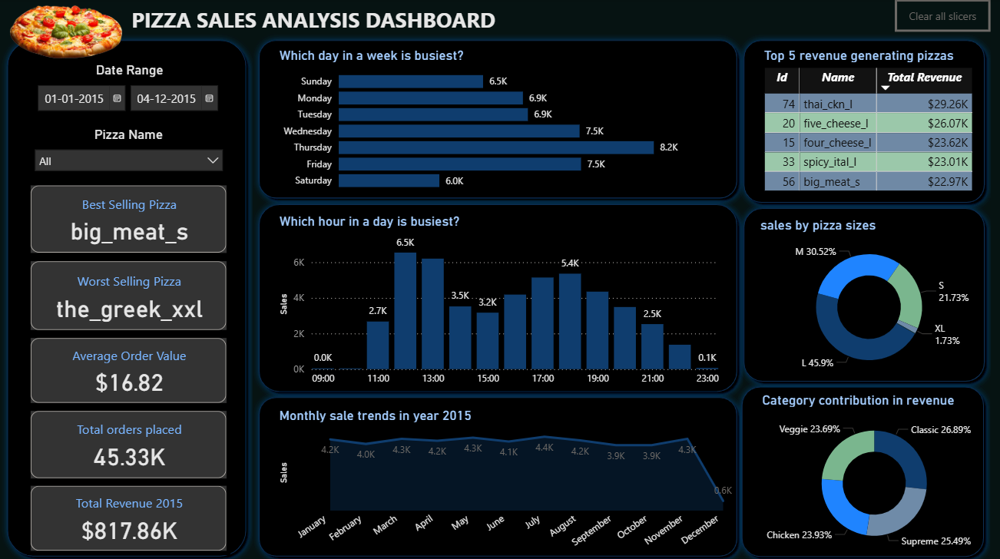

# Pizza-Sales-Analysis-Project

## 🍕 Introduction
---
Welcome to the **Pizza Sales Analysis** project— A SQL and PowerBI based analysis.

A pizza company- Athena’s Oven has gathered extensive transactional data over the past year and now seeks meaningful insights to better understand their sales patterns and make informed decisions. As a data analyst, I’m diving into this data to uncover trends and opportunities that can help the business enhance its sales performance and drive greater revenue.

#### 🔍 Project Goals

Your task is to transform raw data into actionable insights, with particular focus on:

- 🕒 Identifying the busiest times for the restaurant
- 🍕 Measuring pizza production during peak periods
- 🌟 Highlighting best and worst-selling pizzas
- 💸 Calculating the average order value
- 💰 Revealing which pizza generates the **highest revenue** overall
- 📅 Uncovering **weekday sales patterns** to optimize staffing and inventory

This README walks you through the project structure, database design, analytical approach, and visual dashboard created to answer these business-critical questions.

## 🛠️ Tools I Used
---
- **SQL**: Employed for comprehensive data transformation and querying. Crafted normalized table structures from raw transactional data to ensure relational integrity and analytical flexibility.
- **PostgreSQL**: Used as the database engine to store, manage, and optimize data. Enabled efficient joins and aggregations across normalized tables.
- **GitHub**: Utilized for version control, documentation, and sharing of both raw and structured data files with the community.
  
- This project involved cleaning and restructuring raw sales data into a set of normalized tables (e.g., Orders, Pizzas) to enable more efficient querying and scalable analysis. The final dashboard reflects this organized structure, making insights clearer and more actionable. This project showcases the transformation of raw sales data into a relational model using best practices in database design, enabling visualizations through a dynamic dashboard.

## 📁 Project Folder Structure
---
```text
Pizza-Sales-Analysis/
├── CSV Files/
│   ├── PizzaSales.csv         # Combined raw sales data with details
│   ├── Pizzas.csv             # Pizza metadata (e.g., type, size, category)
│   └── Orders.csv             # Order transaction information
│
├── SQL Files/
│   ├── Schema.sql             # SQL script to create database schema
│   └── Views.sql              # Analytical SQL views for insights
│
├── Pizza Sales Dashboard.pbix # Power BI dashboard for data visualization

└── README.md                  # Project documentation
```

## 📂 Database Schema
---


## 🗃️ Database Schema Overview
---
The project utilizes two main relational tables to store and analyze pizza sales data:

### 1. `pizzas` Table  
Contains metadata about different pizzas.

- **Row count:** 91  
- **Primary key:** `pizza_id`

| Column Name       | Description                               |
|-------------------|-------------------------------------------|
| `pizza_id`        | Unique identifier for each pizza (Primary Key) |
| `pizza_name_id`   | Short name or code for the pizza          |
| `pizza_name`      | Full display name of the pizza            |
| `pizza_size`      | Available size (e.g., S, M, L, XL)         |
| `unit_price`      | Price of one unit                         |
| `pizza_category`  | Category (e.g., Classic, Veggie, Chicken, Supreme) |
| `pizza_ingredients` | List of ingredients                      |

---

### 2. `orders` Table  
Captures transaction-level sales data.

- **Row count:** 48,620  
- **Foreign key:** `pizza_id` references `pizzas(pizza_id)`

| Column Name     | Description                                    |
|------------------|------------------------------------------------|
| `order_id`      | Unique identifier for each order               |
| `pizza_id`      | Identifier linking to the pizza ordered (Foreign Key) |
| `order_datetime`| Timestamp of when the order was placed         |
| `quantity`      | Number of pizzas ordered                       |
| `total_price`   | Total cost for the ordered quantity            |


### 🧠 SQL Work: View-Based Analysis
---  
#### 1️⃣ Identifying the busiest times for the restaurant:
- **Days with Most Orders:**
```sql
CREATE VIEW vw_BusyDaysAtSales AS
SELECT 
  EXTRACT(DAY FROM order_datetime) AS order_day,
  COUNT(*) AS total_orders
FROM orders
GROUP BY EXTRACT(DAY FROM order_datetime)
ORDER BY total_orders DESC;
  ```

- **Hours with Most Orders:**
```sql
CREATE VIEW vw_BusyHoursAtSales AS
SELECT 
  MAKE_TIME(order_hour, 0, 0) AS order_time, 
  total_orders 
FROM (
  SELECT 
    EXTRACT(HOUR FROM order_datetime)::INT AS order_hour,
    COUNT(*) AS total_orders
  FROM orders
  GROUP BY EXTRACT(HOUR FROM order_datetime)
  ORDER BY total_orders DESC
) AS temptbl;
```

#### 2️⃣ Measuring pizza production during peak periods:
 - **Pizza Sales at Peak Days:**
```sql
CREATE VIEW vw_PizzasDuringPeakDays AS
SELECT 
  EXTRACT(DAY FROM order_datetime) AS order_day,
  SUM(quantity) AS total_pizzas
FROM orders
GROUP BY EXTRACT(DAY FROM order_datetime)
ORDER BY total_pizzas DESC;
```

- **Pizza Sales at Peak Hours:**
```sql
CREATE VIEW vw_PizzasDuringPeakHours AS
SELECT 
  EXTRACT(HOUR FROM order_datetime) AS order_hour,
  SUM(quantity) AS total_pizzas
FROM orders
GROUP BY EXTRACT(HOUR FROM order_datetime)
ORDER BY total_pizzas DESC;

```
#### 3️⃣ Highlighting best and worst-selling pizzas:
- **Best Selling Pizza:**
```sql
CREATE VIEW vw_BestSellingPizza AS
SELECT 
  o.pizza_id, 
  p.pizza_name_id,
  SUM(o.quantity) AS total_sold
FROM orders o
INNER JOIN pizzas p ON o.pizza_id = p.pizza_id
GROUP BY o.pizza_id, p.pizza_name_id
ORDER BY total_sold DESC
LIMIT 1;

```
- **Worst Selling Pizza:**
```sql
CREATE VIEW vw_WorstSellingPizza AS
SELECT 
  o.pizza_id, 
  p.pizza_name_id,
  SUM(o.quantity) AS total_sold
FROM orders o
INNER JOIN pizzas p ON o.pizza_id = p.pizza_id
GROUP BY o.pizza_id, p.pizza_name_id
ORDER BY total_sold ASC
LIMIT 1;

```

#### 4️⃣ Calculating the average order value:
```sql
CREATE VIEW vw_AverageOrderValue AS
SELECT 
  ROUND(AVG(total_price)::numeric, 2) AS average_order_value
FROM orders;

```

#### 5️⃣ Revealing which pizza generates the highest revenue overall:
  ```sql
CREATE VIEW vw_HighestRevenuePizza AS
SELECT 
  p.pizza_name_id,
  ROUND(SUM(o.total_price)::numeric, 2) AS revenue
FROM orders o
JOIN pizzas p ON o.pizza_id = p.pizza_id
GROUP BY p.pizza_name_id
ORDER BY revenue DESC;

```

#### 6️⃣ Uncovering weekday sales patterns to optimize staffing and inventory:
```sql

CREATE VIEW vw_WeekdayPatterns AS
SELECT 
  EXTRACT(DOW FROM order_datetime) AS weekday,
  SUM(quantity) AS quantity_sold
FROM orders
GROUP BY EXTRACT(DOW FROM order_datetime);

```
## 📊 Dashboard Preview
---


## 🔍 Insights Gained
---
Through extensive data exploration and dashboard analysis, the following key insights were uncovered from Athena’s Oven's pizza sales data:

- 🕛 **Peak Hour:** The busiest time of day for pizza sales is **12:00 PM**, with approximately **6.5k sales** during that hour alone.
- 📆 **Seasonal Surge:** The **July–August** period saw the highest pizza production volume, totaling **4,392 pizzas**.
- 🍕 **Best & Worst Sellers:**
  - **Best-selling pizza:** `big_meat_s`
  - **Worst-selling pizza:** `the_greek_xxl`
- 💳 **Average Order Value:** Customers spent an average of **$16.82** per order.
- 💰 **Top Revenue Generator:** `thai_ckn_l` emerged as the most profitable pizza, generating **$29.26k** in annual revenue.
- 📊 **Weekday Pattern:** **Thursdays** recorded the highest sales activity across all weekdays with approximately **8.2k sales**.

### 📊 Additional Insights
---
Beyond core sales trends, Athena’s Oven's data reveals further dimensions of customer preferences:

- 📐 **Size Preference:** Large (`L`) size pizzas dominated the menu, accounting for **45.9%** of all annual sales—highlighting a clear customer inclination for bigger portions.
  
- 🏷️ **Category Strength:** The **Classic pizza** category led the pack, contributing a notable **26.89%** of total annual sales. This suggests a strong loyalty toward traditional flavors compared to gourmet or veggie offerings.

- 🧾 **Order Volume:** A total of **45.327k orders** were placed throughout the year, reflecting robust customer engagement and consistent demand.

- 💵 **Annual Revenue:** The business generated an impressive **$817.86k** in total revenue over the year—demonstrating solid profitability and market traction.

These insights can guide data-driven decisions and strategic decisions around inventory, promotions, and menu adjustments to better align with customer demand.
